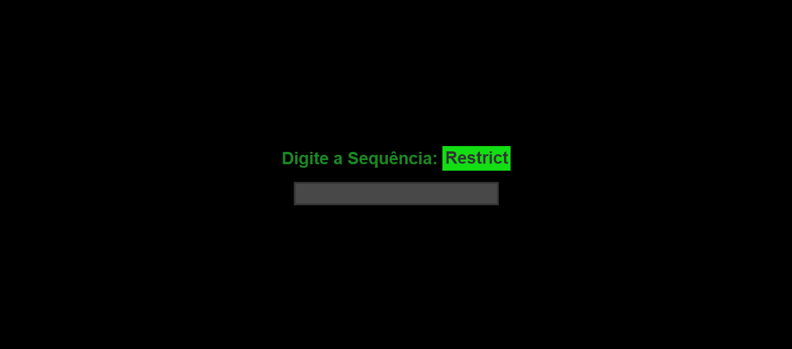

## Sobre:

Este projeto consiste em mostrar um Easter EGG que aparece na tela quando o usuario digita o comando indicado na tela, assim o usuario é direcionado para uma pagina na qual mostra um gif ou alguma imagem, claro que na maioria dos EASTER EGG eles são bem escondidos e o usuario precisa descobrir que a página possui um e prestar atentação nos detalhes para descobir o que é ou significa.
Este é um projetinho simples que fiz acompanhando um video, recriei para que eu pudesse aprimorar o que venho aprendendo em HTML, CSS e principalmente o JavaScript.
 
 

## Tecnologias usadas:
<li>HTML</li>
<li>CSS</li>
<li>JavaScript</li>

## Referências:
<li>https://www.youtube.com/watch?v=6KS4t97yMlI&ab_channel=MarioSouto-DevSoutinho</li>
